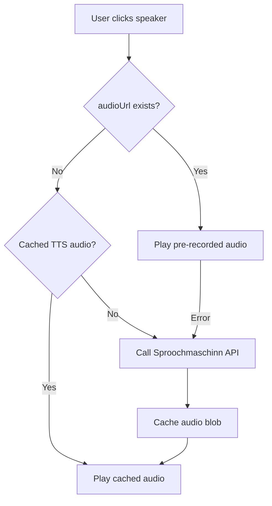

# Sproochmaschinn TTS Integration Plan

## Goal

Replace the German TTS fallback with authentic Luxembourgish TTS from sproochmaschinn.lu when no pre-recorded audio exists.

***

## API Summary

| Endpoint                       | Purpose                         |
| ------------------------------ | ------------------------------- |
| `POST /api/session`            | Create session (required first) |
| `POST /api/tts/{session_id}`   | Submit TTS request              |
| `GET /api/result/{request_id}` | Poll for audio result           |

**Key Constraints:**

* Sessions expire after **10 minutes** of inactivity
* Rate limit: **10 requests/minute** per session
* Max text: **25,000 characters**
* Returns **base64-encoded WAV** audio
* 3 voice models: `claude` (default), `max`, `maxine`

***

## Proposed Architecture



***

## Implementation Steps

### 1. Create Sproochmaschinn Service

**File:** `src/services/sproochmaschinnService.ts`

```typescript
class SproochmaschinnService {
  private sessionId: string | null = null;
  private sessionExpiry: number = 0;
  private audioCache: Map<string, string> = new Map(); // text -> blob URL
  private voiceModel: 'claude' | 'max' | 'maxine' = 'claude';
  
  async ensureSession(): Promise<string>
  async speak(text: string): Promise<string> // returns blob URL
  async prefetchAudio(texts: string[]): Promise<void>
  clearCache(): void
  setVoiceModel(model: string): void
}
```

### 2. Session Management

* Create session on first TTS request
* Refresh session if expired (10 min timeout)
* Store session ID in memory (not localStorage for privacy)

### 3. Audio Caching Strategy

* Cache audio blobs in memory by text hash
* Limit cache size (e.g., last 100 items)
* Optional: persist to IndexedDB for offline use

### 4. Update Flashcard Component

**File:** [src/components/Flashcard.tsx](file:///Users/arman/Desktop/Flashcard/src/components/Flashcard.tsx)

Replace [playTextToSpeech()](file:///Users/arman/Desktop/Flashcard/src/components/Flashcard.tsx#57-65):

```typescript
const playTextToSpeech = async () => {
  try {
    setIsLoadingAudio(true);
    const blobUrl = await sproochmaschinnService.speak(card.luxembourgish);
    const audio = new Audio(blobUrl);
    await audio.play();
  } catch (error) {
    console.error('Sproochmaschinn TTS failed:', error);
    // Ultimate fallback to browser TTS
    fallbackToGermanTTS();
  } finally {
    setIsLoadingAudio(false);
  }
};
```

### 5. Add Settings UI

**File:** [src/components/Settings.tsx](file:///Users/arman/Desktop/Flashcard/src/components/Settings.tsx)

Add TTS preferences:

* Voice model selector (Claude/Max/Maxine)
* Enable/disable Sproochmaschinn TTS
* Fallback to German TTS toggle

### 6. Error Handling & Fallback Chain

```
1. Pre-recorded audioUrl → 
2. Sproochmaschinn TTS → 
3. German browser TTS (ultimate fallback)
```

***

## Technical Considerations

### Rate Limiting

* Queue requests to stay under 10/min
* Show loading indicator during API calls
* Consider prefetching for study sessions

### CORS

* API may require proxy if CORS blocked
* Test from browser first
* Fallback: use serverless function as proxy

### Audio Format

* API returns base64 WAV
* Convert to Blob URL for playback:

```typescript
const audioBlob = base64ToBlob(result.data, 'audio/wav');
const blobUrl = URL.createObjectURL(audioBlob);
```

***

## Files to Create/Modify

| Action    | File                                                                                                         |
| --------- | ------------------------------------------------------------------------------------------------------------ |
| \[NEW]    | `src/services/sproochmaschinnService.ts`                                                                     |
| \[MODIFY] | [src/components/Flashcard.tsx](file:///Users/arman/Desktop/Flashcard/src/components/Flashcard.tsx)           |
| \[MODIFY] | [src/components/Settings.tsx](file:///Users/arman/Desktop/Flashcard/src/components/Settings.tsx) (if exists) |
| \[NEW]    | `src/hooks/useSproochmaschinn.ts` (optional)                                                                 |
| \[MODIFY] | [src/types/index.ts](file:///Users/arman/Desktop/Flashcard/src/types/index.ts) (add settings types)          |

***

## Verification Plan

### Manual Testing

1. Click speaker icon on flashcard without audioUrl
2. Verify Luxembourgish pronunciation plays
3. Test all 3 voice models
4. Verify caching (second click plays instantly)
5. Test error fallback (disconnect network)

### Browser Testing

* Test in Chrome, Firefox, Safari
* Verify CORS handling
* Check mobile browser support

***

## Open Questions for User

1. **Voice preference**: Which default voice? (Claude/Max/Maxine)
2. **Caching**: Should we cache audio in IndexedDB for offline use?
3. **Prefetching**: Auto-fetch audio for next cards in study session?
4. **Settings**: Add UI to switch voice models?
5. **CORS**: If API blocks browser requests, should we add a proxy?
